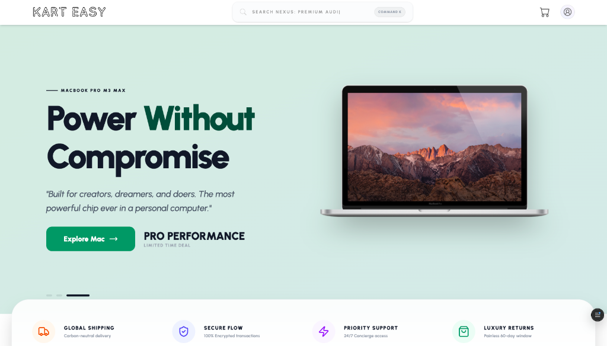

# Kart Easy | Premium Procurement Nexus 🍱🛒

Kart Easy is a high-end, cinematic e-commerce platform designed for an elite shopping experience. Featuring "Search Nexus V3.0," glassmorphic interfaces, and a sophisticated "Elite Protocol" authentication system, it redefines modern digital procurement.

## 🌌 The Elite Suite: Comprehensive Interface

### 🖥️ 1. Master Landing Page (Nexus Home)
The central hub for all procurement. Features a radiant hero section with premium typography, dynamic category nodes, and curated product showcases. Built with high-fidelity transitions to ensure a stunning first impression.

### 🔍 2. Search Nexus V3.0 (Search)
A futuristic search engine with typewriter animations, Command+K shortcuts, and a dense, high-fidelity results grid. Features "Matched Elite Entities" counting and ultra-wide product distributions optimized for large displays.

### 🧠 3. Entity Intelligence Hub (Product Details)
A deep-dive analytic view for every procurement item. Includes high-resolution imagery, detailed specifications, and related entity suggestions to streamline specialized acquisitions.

### 🛒 4. Acquisition Queue (Shopping Cart)
Real-time staging area for pending transactions. Features glassmorphic item cards, quantity management, and a high-contrast summary breakdown of the total investment.

### 💳 5. Transaction Protocol (Checkout)
A secured, multi-step settlement flow. Includes high-precision address entry, "Elite Selection Cards" for payment (UPI, Quantum Credit, Legacy Delivery), and automatic scroll-to-top resets for a seamless user journey.

### 🔐 6. Authorization Gateway (Login)
The secure entry point to the Nexus. Features high-contrast visuals, glassmorphic forms, and bulletproof session management via the "Elite Protocol."

### 📝 7. Identity Registry (Registration)
Secondary enrollment node with auto-sync capabilities. Automatically transitions new identities into the system with immediate session initiation.

### 📂 8. Recovery Protocol (Forgot Password)
Encrypted credential restoration flow. Aligned with the "Elite" aesthetic, ensuring even recovery processes feel premium and secure.

### 📟 9. Dual-Factor Sync (OTP Verification)
A critical security handshake layer for identity validation, preventing unauthorized node access.

### 📊 10. Personal Nexus Hub (User Profile)
A dynamic dashboard that tracks order counts and assigns your "Nexus Rank" (Rookie → Pro → Elite → Legend) based on your engagement history.

### 📜 11. Procurement History (My Orders)
An immutable ledger of all past acquisitions, displayed in high-density cards with status tracking badges.

### 📈 12. Deep Analytics (Order Details)
Granular breakdown of individual transactions, providing full transparency into logistics and financial settlement for every item.

## 🛠️ Technical Architecture

- **Frontend Core**: React 19 + Vite (Turbocharged Performance)
- **Global State**: Redux Toolkit (State Persistence Protocol)
- **Styling Architecture**: Vanilla CSS + Tailwind Core (High-Fidelity UI Tokens)
- **Database & Auth**: Supabase Core (Postgres Security Layer)
- **Visual Intelligence**: Lucide Icons & Framer Motion (Dynamic Aesthetics)

## 🚀 Initialization Sequence

1. **Clone the Registry**: `git clone https://github.com/deepak1293g/Kart-Easy.git`
2. **Install Dependencies**: `npm install`
3. **Configure Authorization**: Set `VITE_SUPABASE_URL` and `VITE_SUPABASE_ANON_KEY` in `.env`
4. **Initialize Nexus**: `npm run dev`

---
*For those who demand excellence in digital procurement.*
